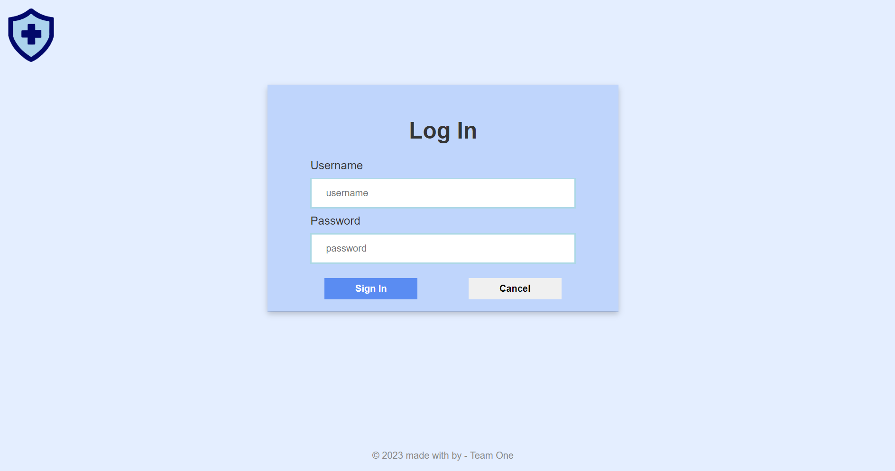
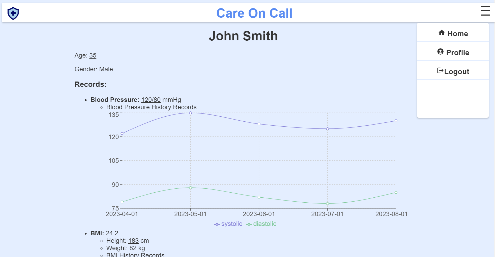
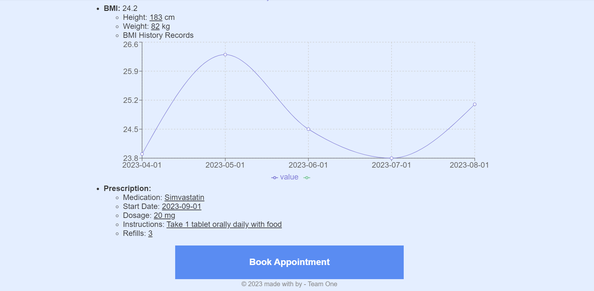
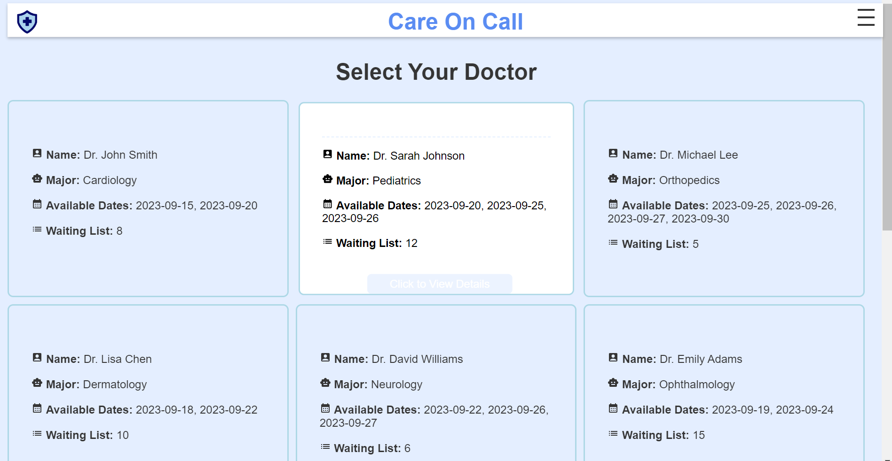
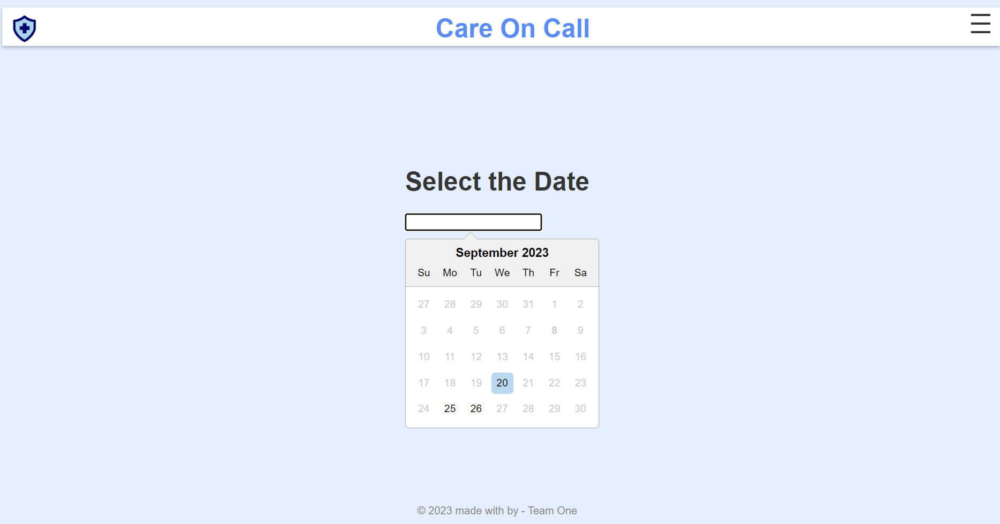

# Care-On-Call Website

## Achievement
This **Care-On-Call** project ranked **top 5** in *WIT (Women in Technology) x Atlassian x AWS x McKinsey Hackathon* in 2023.

> Know more about this project, you can view the slides [here](./Happu_Health_Co..pdf).

## Finished features
- Login
E.g. try `username="admin"` & `password="admin"` to login

- User Profile

- Select the Doctor

- Book your Appointment

## How to Run the Code
`npm start`

## Future Features
- AI analysis for customers' health status

## Thank-you Notes

I would like to express my sincere gratitude to the following individuals for their valuable contributions and support:

1. [Sukhleen](https://github.com/sandiegokwondan45)
2. [Jin](https://github.com/Sukii08)
